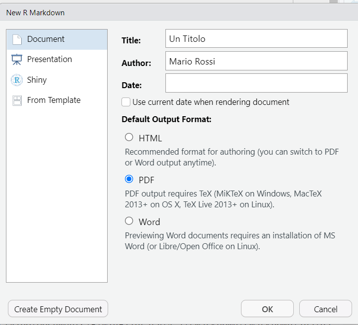

```{r setup, include=FALSE}
knitr::opts_chunk$set(echo = TRUE, fig.width= 4.5, 
                                   fig.height= 3.5, 
                                   fig.align= "center")
```

# Installazioni preliminari
I seguenti comandi sono utili per installare i pacchetti necessari alla generazione di un report in formato pdf.

1. Eseguire da console il seguente comando per installare, se non presente, il pacchetto `rmarkdown`. 
```{r}

if(system.file(package = "rmarkdown") == "") install.packages("rmarkdown")

```

2. Eseguire da console il seguente comando per installare, se non presente, il pacchetto `knitr`.
```{r}
if(system.file(package = "knitr") == "") install.packages("knitr")
```


3. Eseguire da console i seguenti comandi per installare il pacchetto `tinytex`.
```{r, eval=FALSE}
install.packages("tinytex")
tinytex::install_tinytex()
```

# Crea il tuo primo file 

* Da RStudio: **File**$\rightarrow$ **New File** $\rightarrow$  **R Markdown...** 

{width=90%}

* Scegliere Titolo, Autore, Data (i campi possono rimanere vuoti). Seleziona **PDF** come formato di output. Premere **OK**.  

{width=45%}

* Salvare file (in formato **.Rmd**).  

* Genera il file pdf tramite combinazione di tasti `CTRL+Shift+K` oppure tramite interfaccia grafica, come mostrato nella figura che segue, cliccando su **Knit**.

{width=85%}

# Paragrafi

* `#` ti permette di creare un nuovo paragrafo 

* `\newline` ti permette di andare a capo 

**Attenzione** Lasciare almeno una riga vuota prima di scrivere un nuovo paragrafo.

##### Esempio 

Se Leopardi fosse vissuto nel 2023 avrebbe sicuramente utilizzato `RMarkdown` per scrivere *L'Infinito*.

`# L'Infinito`   \newline
`                                                       `         \newline
`Sempre caro mi fu quest’ermo colle,           \newline`          \newline    
`E questa siepe, che da tanta parte            \newline`            \newline
`Dell’ultimo orizzonte il guardo esclude.      \newline`        \newline
`Ma sedendo e mirando, interminati             \newline`        \newline
`Spazi di là da quella, e sovrumani            \newline`        \newline
`Silenzi, e profondissima quiete               \newline`          \newline
`Io nel pensier mi fingo; ove per poco         \newline`            \newline
`Il cor non si spaura. E come il vento         \newline`        \newline
`Odo stormir tra queste piante, io quello      \newline`            \newline
`Infinito silenzio a questa voce               \newline`        \newline
`Vo comparando: e mi sovvien l’eterno,         \newline`        \newline
`E le morte stagioni, e la presente            \newline`        \newline
`E viva, e il suon di lei. Così tra questa     \newline`        \newline
`Immensità s’annega il pensier mio:            \newline`        \newline
`E il naufragar m’è dolce in questo mare. `                     \newline              

Risultato:

# L'Infinito

Sempre caro mi fu quest’ermo colle,           \newline
E questa siepe, che da tanta parte            \newline
Dell’ultimo orizzonte il guardo esclude.      \newline
Ma sedendo e mirando, interminati             \newline
Spazi di là da quella, e sovrumani            \newline
Silenzi, e profondissima quiete               \newline
Io nel pensier mi fingo; ove per poco         \newline
Il cor non si spaura. E come il vento         \newline
Odo stormir tra queste piante, io quello      \newline
Infinito silenzio a questa voce               \newline
Vo comparando: e mi sovvien l’eterno,         \newline
E le morte stagioni, e la presente            \newline
E viva, e il suon di lei. Così tra questa     \newline
Immensità s’annega il pensier mio:            \newline
E il naufragar m’è dolce in questo mare. 

\newpage 

# Inserire ed eseguire codice: *chunk*

Un *chunk* di codice è una sezione particolare del file RMarkdown che ti permette di inserire e stampare nel file di output codice R. Se non diversamente specificato, ogni riga di codice inserita nel chunk viene eseguita come se fosse digitata da console. Inoltre, se non diversamente specificato anche l'output di ogni riga di codice eseguita viene stampato nel file pdf.      

Di seguito un esempio di chunk: \newline

*` ```{r}`* \
\ *` INSERIRE CODICE QUI `*  \
\ *` ``` `* \


##### Esempio 

In questo esempio le istruzioni presenti nel chunk sono eseguite. Inoltre, sia le istruzioni nel chunk che i risultati di queste istruzioni sono stampati sul file pdf.

*` ```{r}`* \
\ *` print("Hello world!") `*  \
\ *` a = 1 `* \
\ *` print(a)`* \
\ *` ``` `* \

```{r}
print("Hello world!")
a = 1
print(a)
```

##### Esempio 

In questo esempio le istruzioni presenti nel chunk **NON** sono eseguite, ma sono stampate nel file pdf. \newline

*` ```{r, eval=FALSE}`* \
\ *` print("Hello world!") `*  \
\ *` b = 2 `* \
\ *` ``` `* \

```{r, eval=FALSE}
print("Hello world!")
b = 2 
```

##### Esempio 

In questo esempio le istruzioni presenti nel chunk sono eseguite e stampate nel file pdf, ma i risultati di queste espressioni **NON** sono stampati nel file pdf. 

*` ```{r, results='hide'}`* \
\ *` print("Hello world!") `*  \
\ *` c = 3 `* \
\ *` print(c) `* \
\ *` ``` `* \

```{r, results='hide'}
print("Hello world!")
c=3
print(c)
```

##### Esempio 

In questo esempio le istruzioni presenti nel chunk sono eseguite, ma né le istruzioni presenti nel chunk né i risultati vengono stampati nel file pdf.

*` ```{r, include=FALSE}`* \
\ *` print("Hello world!") `*  \
\ *` d = 4 `* \
\ *` print(d) `* \
\ *` ``` `* \

```{r, include=FALSE}
print("Hello world!")
d = 4
print(d)
```

##### Esempio \

` ```{r}` \newline
`x_ = seq(0, pi, length.out=100) ` \newline
`y_ = sin(x_) `        \newline
`plot(x_, y_,type="l",lty=1,lwd=2,xlab="",ylab="",main="sin(x)",cex.axis=1,cex.main=1)`       \newline
` ``` ` 

```{r}
x_ = seq(0,2*pi, length.out=100)
y_ = sin(x_)
plot(x_,y_,type="l",lty=1,lwd=2,xlab="",ylab="",main="sin(x)",cex.axis=1,cex.main=1)
```

##### Esempio \

` ```{r}` \newline
`N = 100`   \newline
`dati = cbind(rnorm(N), rnorm(N,mean=1, sd=0.5))`       \newline
`head(dati)`    \newline
`boxplot(dati)`   \newline
` ``` ` 

```{r}
N = 100
dati = cbind(rnorm(N), rnorm(N,mean=1, sd=0.5))
head(dati)
boxplot(dati)
```


In generale, i chunk possono essere utilizzati come degli script R: 

* Il codice presente può essere eseguito riga per riga con la combinazione di tasti `CTRL+Enter`

* Tutto il contenuto del chunk può essere eseguito da interfaccia grafica cliccando **PLAY** come mostrato dalla figura che segue.


* I valori delle variabili create possono essere controllate in **Environment**

Un nuovo chunk può essere inserito tramite: 

* Combinazione di tasti `CTRL+Alt+I` 

* Interfaccia grafica, cliccando su **+C**, come mostrato dalla figura che segue

{scale=0.75}

##### Attenzione 

All'interno del chunk, assicurarsi di inserire istruzioni (o commenti R) entro la barra verticale evidenziata dalla figura che segue. Questo accorgimento evita che il codice inserito nel chunk possa essere troncato nel file pdf.

{width=85%}

# Materiale supplementare

##### RMarkdown Cookbook \newline
L'obiettivo di questa breve guida è fornire gli strumenti indispensabili per generare un report pdf utile alla valutazione della prova di laboratorio. \newline
Per approfondimenti su `RMarkdown` consultare: 

* [Lezioni RMarkdown](https://rmarkdown.rstudio.com/lesson-1.html)

* [R Markdown Cookbook](https://bookdown.org/yihui/rmarkdown-cookbook/).

##### Shortcuts da tastiera per tilde e backtick (utenti windows) \newline
Di seguito vengono riportate le istruzioni per creare shortcuts da tastiera per i simboli di `~` **(tilde)** (combinazione `AltGr+'`) e   `` ` ``  **(backtick/accento grave)** (combinazione `AltGr+ì`)  

1. Installare [AutoHotKey](https://www.autohotkey.com/) 

2. Scaricare file **shortcuts.ahk** da Materiale Supplementare 

3. Cliccare due volte con il tasto sinistro del mouse su **shortcuts.ahk**, gli shortcuts saranno disponibili fino allo spegnimento del PC

**NB** Ad ogni riavvio del PC ripetere il punto 3) per avere a disposizione gli shortcuts.

<!-- Di seguito vengono riportate anche le istruzioni per rendere disponibili gli shortcuts evitando di ripetere i punti 3) e 4) della precedente lista: -->

<!-- 1. Premere **Win + R**. -->

<!-- 2. Digitare **shell:startup**, Premere **INVIO**. Una cartella verrà aperta.   -->

<!-- 3. Copiare e Incollare **shortcuts.ahk** nella cartella precedentemente aperta. -->

<!-- 4. Chiudere la cartella. -->

<!-- 5. Premere **Win + R**.  -->

<!-- 6. Digitare **shell:common startup**, Premere **INVIO**. Una cartella verrà aperta.  -->

<!-- 7. Copiare e Incollare **shortcuts.ahk** nella cartella precedentemente aperta. -->

<!-- 8. Premere su **Continua**.  -->

<!-- 9. Al riavvio del PC gli shortcuts saranno disponibili automaticamente.   -->

