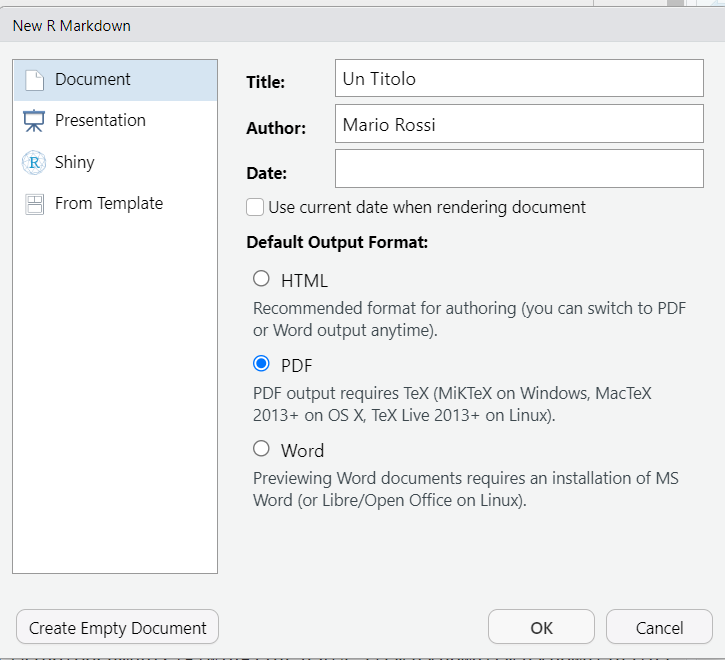

```{r setup, include=FALSE}
knitr::opts_chunk$set(echo = TRUE, fig.width= 4.5, 
                                   fig.height= 3.5, 
                                   fig.align= "center")
```

# Installazioni preliminari
1. Installare *RMarkdown*
```{r, eval=FALSE}
install.packages('rmarkdown')
```

2. Installare *TinyTex*
```{r, eval=FALSE}
install.packages("tinytex")
tinytex::install_tinytex()
```

# Crea il tuo primo file 

* Da RStudio: **File**$\rightarrow$ **New File** $\rightarrow$  **R Markdown...** 

{width=75%}

* Scegli Titolo, Autore, Data e Seleziona **PDF** come formato di output e Premi **OK** 

* Scegli Titolo, Autore, Data e Seleziona **PDF** come formato di output e Premi **OK** 

{width=75%}

* Salva il tuo file 

* Genera output cliccando su **Knit** (oppure tramite combinazione `CTRL+Shift+K`) 

{width=75%}

# Comandi vari

* Con \# posso dare il titolo ad un nuovo paragrafo nel mio File 

* Vado a capo con digitando **\newline** 

**NB** Lasciare almeno una riga vuota prima di iniziare un nuovo paragrafo

##### Esempio
Se Leopardi fosse vissuto nel 2023, avrebbe sicuramente utilizzato `RMarkdown` per scrivere *L'Infinito*.

Risultato: 

# L'Infinito
Sempre caro mi fu quest’ermo colle,           \newline
E questa siepe, che da tanta parte            \newline
Dell’ultimo orizzonte il guardo esclude.      \newline
Ma sedendo e mirando, interminati             \newline
Spazi di là da quella, e sovrumani            \newline
Silenzi, e profondissima quiete               \newline
Io nel pensier mi fingo; ove per poco         \newline
Il cor non si spaura. E come il vento         \newline
Odo stormir tra queste piante, io quello      \newline
Infinito silenzio a questa voce               \newline
Vo comparando: e mi sovvien l’eterno,         \newline
E le morte stagioni, e la presente            \newline
E viva, e il suon di lei. Così tra questa     \newline
Immensità s’annega il pensier mio:            \newline
E il naufragar m’è dolce in questo mare. 


* Per inserire e lanciare codice R creare un "chunk", una sezione particolare racchiusa da \newline

*` ```{r}`* \
\ *` INSERIRE CODICE QUI `*  \
\ *` ``` `* \

##### Esempio \

*` ```{r}`* \
\ *` print("Hello world!") `*  \
\ *` ``` `* \


```{r}
print("Hello world!")
```

### Creare un nuovo Chunk

Puoi creare un nuovo chunk in uno dei seguenti modi: 

* Tramite shortcuts: `CTRL+Alt+I` (windows) o `cmd+Alt+I`  macOs)

* Tramite interfaccia grafica 

{scale=0.75}

I chunk hanno le stesse caratteristiche degli script R: 

* Puoi eseguire riga per riga con la combinazione `CTRL+Enter` (come R script)

* Puoi eseguire l'intero chunk da interfaccia grafica premendo **PLAY**


* Puoi controllare variabili create in **Environment**  

* Output del codice viene stampato di seguito al chunk come se lanciassi comandi dalla console  

* All'interno del chunk, assicurati di non superare la barra verticale posta sulla destra 

{width=85%}

Risultato nel PDF:

```{r}
# Attenzione Attenzione Attenzione Attenzione Attenzione Attenzione Attenzione Attenzione Attenzione 
print("Questa stringa è troppo LUNGA... Questa stringa è troppo LUNGA... Questa stringa è troppo LUNGA... ")

```


**NB** Controlla che il codice inserito nei chunk sia corretto prima di generare il file output 

##### Esempio 
```{r}
x_ = seq(0,2*pi, length.out=100)
y_ = sin(x_)

plot(x_, y_, 
     type = "l", lty=1, lwd=2, 
     xlab = "", ylab = "",
     main="sin(x)", cex.axis=1,cex.main=1)
```

##### Esempio

Codice:

{width=85%}

```{r}
N = 100
dati = cbind(rnorm(N), rnorm(N,mean=1, sd=0.5))
head(dati)
boxplot(dati)
```

# Materiale supplementare

##### RMarkdown Cookbook
Questa rapida guida contiene il minimo per seguire i laboratori e generare un file per il superamento della prova di laboratorio. \newline

Per approfondimenti fare riferiemnto a [R Markdown Cookbook](https://bookdown.org/yihui/rmarkdown-cookbook/)

##### Shortcuts da tastiera per tilde e back tick (utenti windows)

Spesso gli utenti windows che utilizzano un laptop hanno la necessità di scrivere *rapidamente* i simboli di **tilde** e **back tick** (accento grave). \newline

Di seguito la procedura per creare shortcuts da tastiera per la **tilde** (combinazione `AltGr+'`) e per il **back tick** (combinazione `AltGr+ì`)


1. Installare [AutoHotKey](https://www.autohotkey.com/) . 

2. Scaricare file **shortcuts.ahk** da... . 

3. Premere **Win + R** .

4. Digitare **shell:startup**, Premere **INVIO**. Una cartella verrà aperta.  

5. Copiare e Incollare **shortcuts.ahk** nella cartella precedentemente aperta.

6. Chiudere la cartella.

7. Premere **Win + R**. 

8. Digitare **shell:common startup**, Premere **INVIO**. Una cartella verrà aperta. 

9. Copiare e Incollare **shortcuts.ahk** nella cartella precedentemente aperta.

10. Premere su **Continua**. 

11. Al riavvio del PC gli shortcuts saranno funzionanti.  


